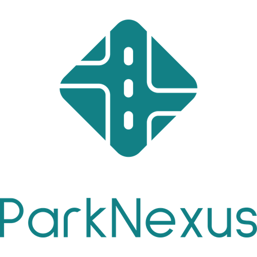

  

Park Nexus is a platform that allows users to find parking spots in their area. Users can search for parking spots by location, price, and availability. We also allows users to rent out their own parking spots to other users.

  
  
   
   

<!-- 

e iPhone 11 Pro Max Screenshot 1](https://github.com/user-attachments/assets/46799300-7fa1-498d-bfac-47b3648e3080)

-->
